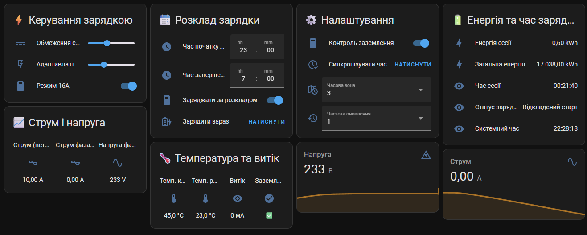

# ⚡ EVSE Charger

> [!NOTE]
> This is not affiliated with [EVEUS][eveus] in any way. This integration is developed by an individual. Information may vary from their official website.

This integration for [Home Assistant][home-assistant] provides ability to control [EVEUS Charger][eveus].
More info [here][eveus-telegram]
## Installation

The quickest way to install this integration is via [HACS][hacs-url] by clicking the button below:

[![Add to HACS via My Home Assistant][hacs-install-image]][hasc-install-url]

If it doesn't work, adding this repository to HACS manually by adding this URL:

1. Visit **HACS** → **Integrations** → **...** (in the top right) → **Custom repositories**
2. Click **Add**
3. Paste `https://github.com/DmytryS/ha-evse-charger` into the **URL** field
4. Chose **Integration** as a **Category**
5. **EVSE Charger** will appear in the list of available integrations. Install it normally.

## 🔧 Feature

- Charging station status display
- Power, voltage, current, temperature sensors
- Charge current control, start/stop charging
- Charging scheduling, timers
- Time synchronization support
- Full local operation without cloud
- UI configuration via Config Flow
- **Energy Star Pro** and **Eveus Pro** support

## License

MIT © [Dmytro Shvaika][DmytryS] + [@V-Plum](https://github.com/V-Plum)

<!-- Badges -->

[gh-release-url]: https://github.com/DmytryS/ha-evse-charger/releases/latest
[gh-release-image]: https://img.shields.io/github/v/release/DmytryS/ha-evse-charger?style=flat-square
[gh-downloads-url]: https://github.com/DmytryS/ha-evse-charger/releases
[gh-downloads-image]: https://img.shields.io/github/downloads/DmytryS/ha-evse-charger/total?style=flat-square
[hacs-url]: https://github.com/hacs/integration
[hacs-image]: https://img.shields.io/badge/hacs-default-orange.svg?style=flat-square

[twitter-url]: https://twitter.com/DmytroShvaika
[twitter-image]: https://img.shields.io/badge/twitter-%40DmytroShvaika-00ACEE.svg?style=flat-square

<!-- References -->

[home-assistant]: https://www.home-assistant.io/
[DmytryS]: https://github.com/DmytryS
[hasc-install-url]: https://my.home-assistant.io/redirect/hacs_repository/?owner=DmytryS&repository=ha-evse-charger&category=integration
[hacs-install-image]: https://my.home-assistant.io/badges/hacs_repository.svg
[add-translation]: https://github.com/DmytryS/ha-evse-charger/blob/master/contributing.md#how-to-add-translation

[eveus-telegram]: https://t.me/Eveus_Chargers
[eveus]: https://www.eveus.com.ua